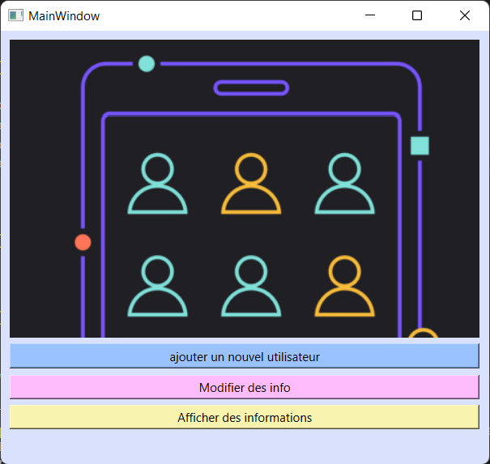
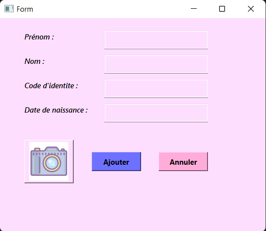
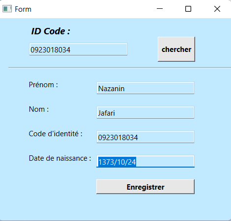
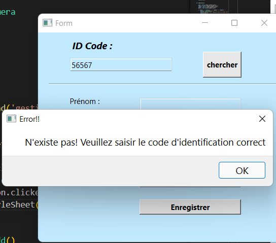
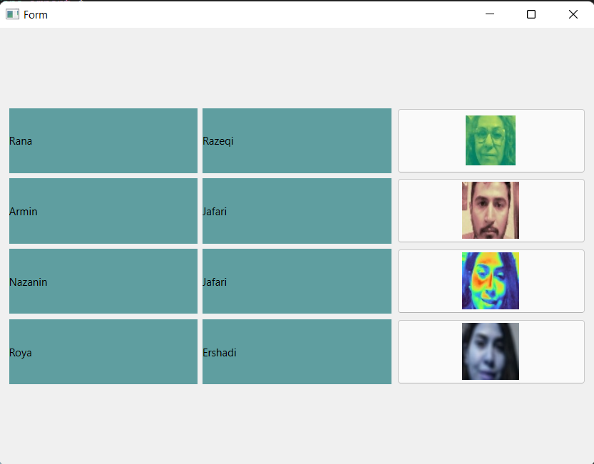

# User_managementApp
This is a software for managing user information: (Add, Edit and Show information)

--- 
### MainWindow :

1. Blue field : for add a new user
2. Pink field : for edit information of userس
3. Yellow field : for show information of all users

___
### ADD user:

the filters used in my program :
(blure, flip, pink, spring, hot, summer, cool ,ocean and turbo)

### Change info:

. find the preferred user by searching the identity code.

after finding the user, the information will be put on the window and you can change it. 
finally press the button 'Enregistrer' (save).

 
 if you give an incorrect code, it will show you an error message :

 

 
 
 
 ### Show user_info :

 